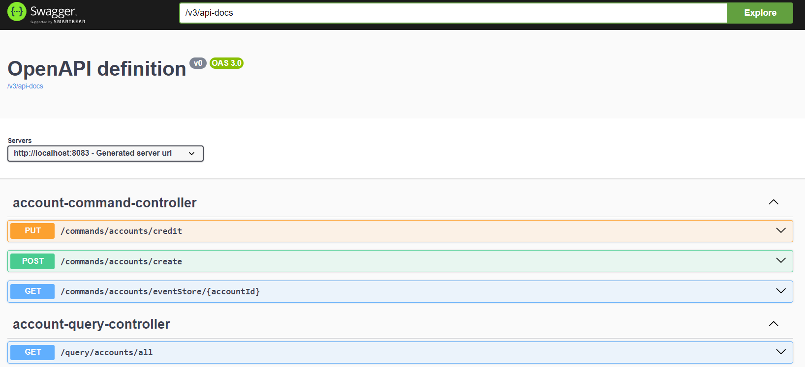
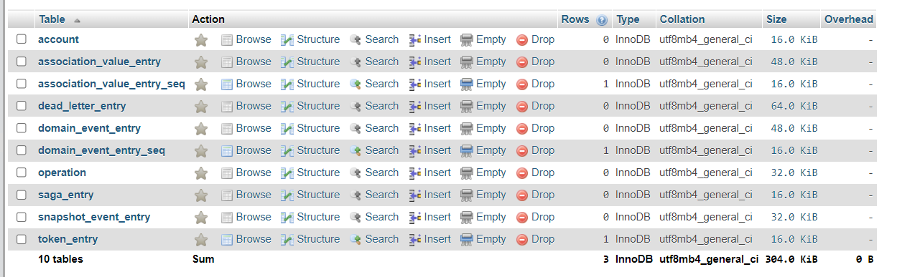
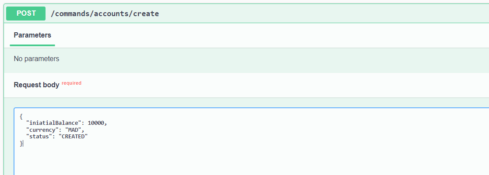
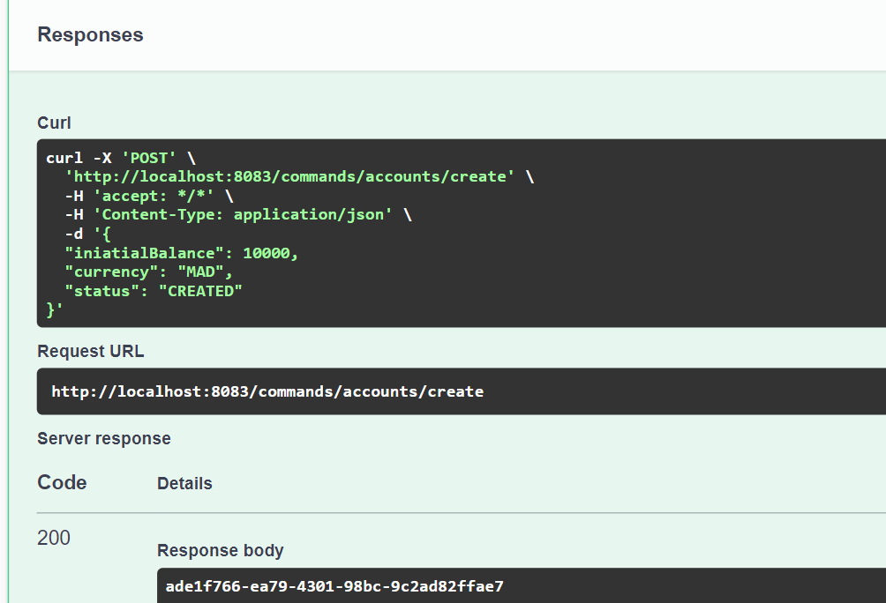
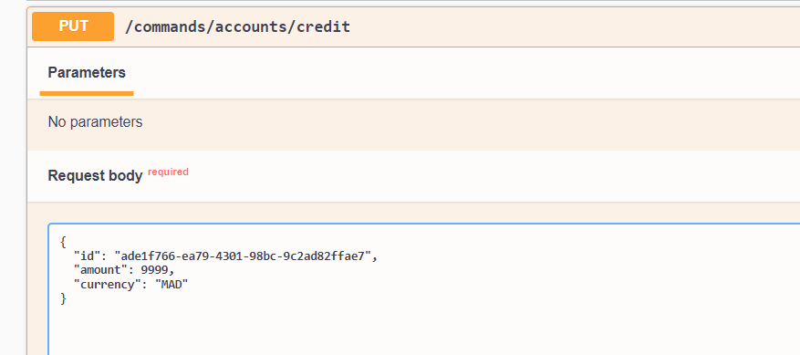
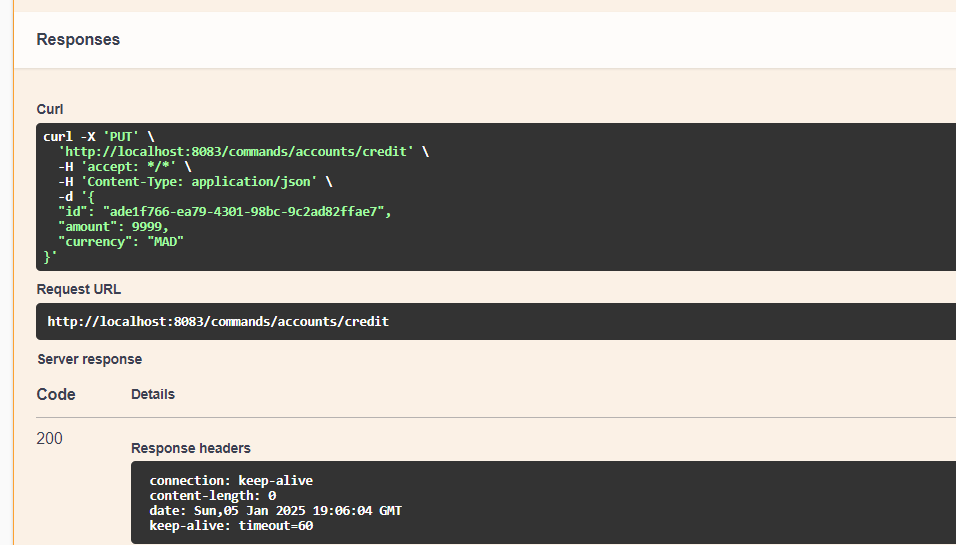
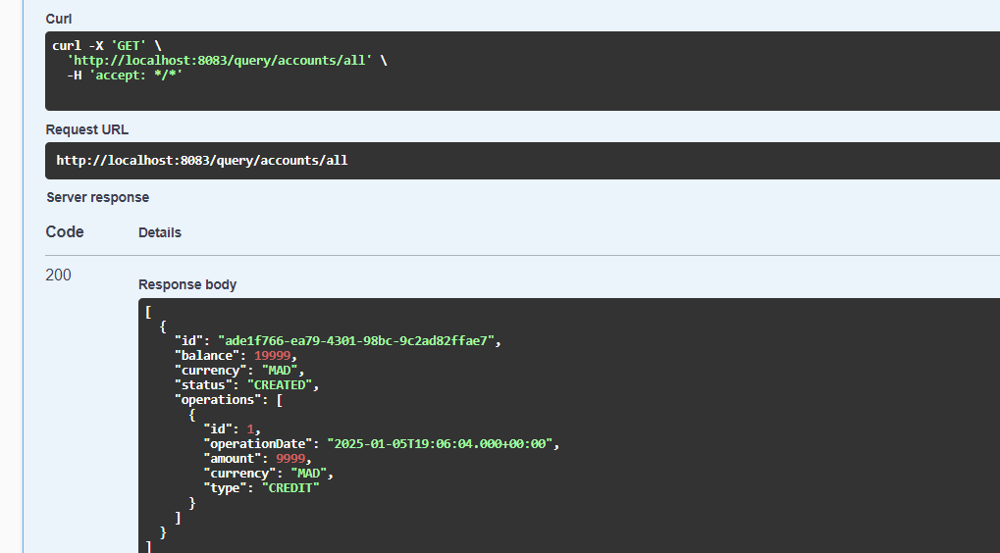
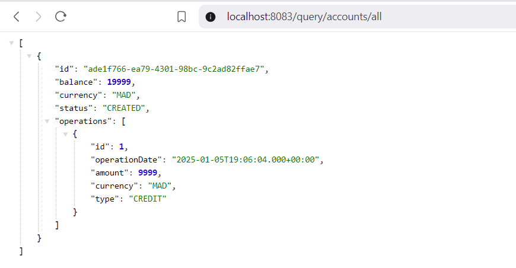

# Simple Spring Boot Application with Axon Framework (CQRS & Event Sourcing)

This application allows you to manage accounts respecting the CQRS and Event Sourcing patterns with the AXON and Spring Boot Frameworks.

## Project Structure
```
   src
    ├───main
    │   ├───java
    │   │   └───com
    │   │       └───errami
    │   │           └───comptecqrses
    │   │               ├───commands
    │   │               │   ├───aggregates
    │   │               │   │       AccountAggregate.java
    │   │               │   └───controllers
    │   │               │           AccountCommandController.java
    │   │               │
    │   │               ├───commonApi
    │   │               │   ├───commands
    │   │               │   │       commands.kt
    │   │               │   ├───dtos
    │   │               │   │       CreateAccountRequestDTO.java
    │   │               │   │       CreditAccountRequestDTO.java
    │   │               │   ├───enums
    │   │               │   │       AccountStatus.java
    │   │               │   │       OperationType.java
    │   │               │   ├───events
    │   │               │   │       events.kt
    │   │               │   └───queries
    │   │               │           GetAllAccountsQuery.java
    │   │               │
    │   │               ├───query
    │   │               │   ├───controllers
    │   │               │   │       AccountQueryController.java
    │   │               │   ├───entities
    │   │               │   │       Account.java
    │   │               │   │       Operation.java
    │   │               │   ├───repositories
    │   │               │   │       AccountRepository.java
    │   │               │   │       OperationRepository.java
    │   │               │   └───services
    │   │               │           AccountServiceHandler.java
    │   │               │
    │   │               └───CompteCqrsEsApplication.java
    │   └───resources
    │       └───application.properties
    └───test
        └───java
```

## Technologies Used
- Java 17
- Spring Boot
- Spring Data JPA
- Axon Framework
- MySQL
- Kotlin
- Lombok

## Functionalities
- Create an account
- Credit an account

## Clone the application
```bash
git clone https://github.com/anaserrami/Event-Sourcing-with-AXON-and-CQRS
cd Event-Sourcing-with-AXON-and-CQRS
```

## How It Works

### Common API
This module contains shared classes:
- **Commands** (e.g. `CreateAccountCommand`, `CreditAccountCommand`)
- **Events** (e.g. `AccountCreatedEvent`, `AccountCreditedEvent`)
- **DTOs** used by both command and query sides

### Command Side (Write)
- **Aggregate**: Where your domain logic lives.
    - Annotated with `@Aggregate`
    - Contains **Command Handlers** to execute commands
    - Contains **Event Sourcing Handlers** to update internal state when events are applied

- **Controller** (example snippet):
  ```java
  @PostMapping("/create")
  public CompletableFuture<String> createAccount(@RequestBody CreateAccountRequestDTO request) {
      return commandGateway.send(new CreateAccountCommand(
              UUID.randomUUID().toString(),
              request.getIniatialBalance(),
              request.getCurrency()
      ));
  }
  ```
    - Uses `CommandGateway` to send commands to the Aggregate.
    - Optionally, you can retrieve an `EventStore` if you want to inspect stored events.

### Query Side (Read)
- **Query Handlers**: Reaction to events to build/read the “query model.”
- **Entities**: JPA/Hibernate entities to store read-side data (e.g. `Account`, `Operation`).
- **Controller** (example snippet):
  ```java
  @GetMapping("/account/{accountId}")
  public CompletableFuture<AccountLookupResponseDTO> getAccount(@PathVariable String accountId) {
      return queryGateway.query(
          new FindAccountQuery(accountId),
          ResponseTypes.instanceOf(AccountLookupResponseDTO.class)
      );
  }
  ```
    - Uses `QueryGateway` to fetch data from the read model.

## Testing the application
- Swagger interface :



- MySQL database :



- Create an account : Shows the command to create a new account and the resulting ID.




- Credit an account : Shows an example PUT request to credit the account.




- Query API : Displays the read side’s data, such as account balances and operations.


